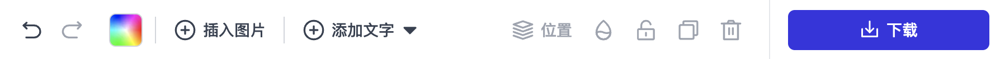

import StyledIframe from '@site/src/components/StyledIframe';
import Highlight from '@site/src/components/Highlight';

# Toolbar UI

<Highlight color="#dfd9fe">Toolbar</Highlight> UI组件，用于更改画布上的元素，它具有很多对画布操作的功能，比如：排序、对齐、撤消/重做、修改画布背景、添加文字图片元素等。



基本的用法：

```js
import { Toolbar } from 'zhihui-editor/lib/toolbar/toolbar';
import { Workspace } from 'zhihui-editor/lib/canvas/workspace';

const App = ({ store }) => {
  return (
    <div
      style={{
        display: 'flex',
        height: '100%',
        margin: 'auto',
        flex: 1,
        flexDirection: 'column',
        position: 'relative'
      }}
    >
      <Toolbar store={store} />
      <Workspace store={store} />
    </div>
  );
};
```

此外，<Highlight color="#dfd9fe">Toolbar</Highlight>组件还具有其他属性，可以隐藏某些元素并覆盖某些属性的输入。

```js
type ToolbarProps = {
  store: StoreType,
  downloadButtonEnabled?: Boolean, // 是否显示下载按钮，默认 false
  // 自定义它的组件
  components?: any,
};

// 例子
<Toolbar store={store} downloadButtonEnabled />;
```

## 如何覆盖元素类型的默认设置？​

Toolbar 支持通过设置 <Highlight color="#dfd9fe">components</Highlight> 属性来，添加/删除/更改其大部分的UI组件。

<StyledIframe src="https://codesandbox.io/embed/cfs3cc?view=preview&module=%2Fsrc%2Findex.js&hidenavigation=1"></StyledIframe>
