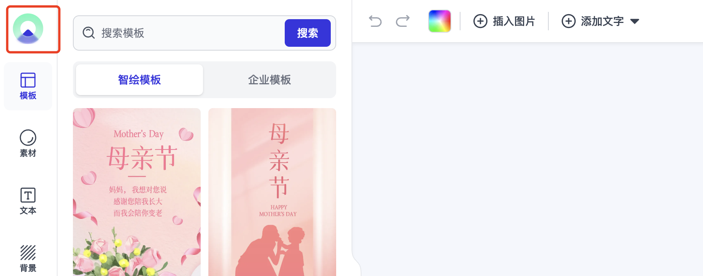

# 基础配置

## 如何更改图片上传行为？

默认的 [SidePanel 组件](/docs/side-panel/side-panel-overview) 具有 <code>Upload</code> 用于将本地图像导入项目的选项卡。默认情况下 Zhihui Editor 只是将本地文件转换为 base64 字符串。生成的 URL 字符串用于 image 元素。使用 base64 字符串可能会生成较大尺寸的项目，因为图像将完全编码在 JSON 内。

**强烈建议将图像上传到您的服务器**。这将使 JSON 更小、更易于阅读，并且还显着提高编辑器的性能。

如果你想将本地图片上传到服务器，可以这样做：

```jsx
import { setUploadFunc } from 'zhihui-editor/lib/config';

// 定义我们的上传函数
// 你必须编写自己的逻辑，适合你的 API
async function upload(localFile) {
  const formData = new FormData();
  formData.append('files[]', localFile);
  const res = await fetch(yourServerURL, {
    method: 'POST',
    body: formData
  });
  const json = await res.json();
  const { url } = json;
  // 返回图片url
  return url;
}

// 设置新的上传方法
setUploadFunc(upload);
```

## UI如何翻译？

我们默认制作了中文、英文两种语言包，可以通过以下方式设置：

```jsx
import en_US from 'zhihui-editor/lib/locale/enUS';
import zh_CN from 'zhihui-editor/lib/locale/zhCN';
import { setTranslations } from 'zhihui-editor/lib/config';

// 设置英文
setTranslations(en_US);

// 设置中文
setTranslations(zh_CN);
```

如果中英文无法满足，您可以自定义将 UI 翻译成其他语言或更改一些标签，可以使用以下命令：

```jsx
import { setTranslations } from 'zhihui-editor/lib/config';
setTranslations({
  sidePanel: {
    text: '文本',
    templates: '模板'
    ...
  }
});
```

如果您需要了解完整的翻译对象，您可以使用：

```jsx
import { getTranslations } from 'zhihui-editor/lib/config';

// 完整的翻译对象
console.log(getTranslations());
```

## 如何更改可用字体？​

Zhihui Editor 中实际上有三种字体：

- 默认免费字体
- 全局字体（商业字体）
- 模板中使用到的字体

### 1.默认的免费字体

默认我们会收集到一些免费字体添加到全局字体中，可以通过一下方法查看全局有哪些字体可用：

```jsx
import { getGlobalFonts } from 'zhihui-editor/lib/config';

// 获取全局字体列表
console.log(getGlobalFonts());
```

### 2.用户自定义字体

如果您想添加/删除特定于用户的字体，您可以使用[Store Fonts API](/docs/Store-API/store-overview#字体)。

用户也可以从侧面板的“文本”面板的我的字体选项中来添加/删除字体。（这里的字体默认读取的是Store.fonts中的字体，也是当前画布中用到的字体）

### 3.全局字体

Store 本身维护这两组字体数据，一个是 Store.fonts 的当前模板中所用到字体，另一个就是全局字体 globalFonts ，全局字体又分免费字体、付费字体2个部分组成。
如果您想添加要为全部用户所用的字体，可以通过 <code>global API</code>，通过 global API 添加的字体不会被添加到 Store.fonts 中。

```jsx
import { addGlobalFont } from 'zhihui-editor/lib/config';

// 通过 URL 添加字体
addGlobalFont({
  src: url,
  name: 'MyCustomFontName',
  fontFamily: 'MyCustomFont',
  img: 'MyCustomFontImg'
});

// 如果某种字体已经通过某些 CSS 添加到页面中
// 你可以在 Zhihui Editor 中直接注册它
// 这样它就可以在工具栏中的可用字体中列出
addGlobalFont({
  fontFamily: 'MyCustomFont'
});
```

## 隐藏或更改logo

我们的侧面板默认是带logo的，并且是带链接的


如果不需要logo，可以通过配置 SidePanel 组件的一些参数隐藏它

```jsx
import { SidePanel } from 'zhihui-editor/lib/side-panel';
// isShowLogo true为设置隐藏logo，默认是false为显示
<SidePanel store={store} isShowLogo={true} />;
```

可以通过设置[SidePanel 组件](/docs/侧面板/side-panel-overview)的 <code>logo</code> 跟 <code>logoHref</code> 参数也替换默认设置的logo跟链接

```jsx
<SidePanel store={store} logo="MyCustomLogoUrl" logoHref="MyCustomlogoHref" />
```
