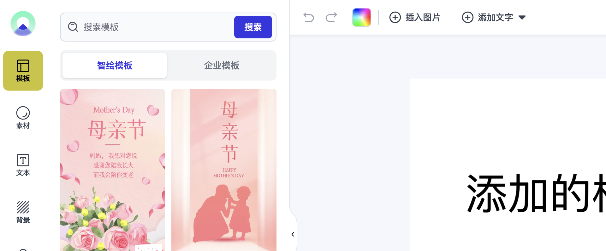

# 主题和风格

可以自定义 Zhihui Editor 的样式以匹配您的设计。

Zhihui Editor UI 的大部分都是用 [Tailwind CSS](https://tailwindui.com/) 框架制作的。如果您想更改 Zhihui Editor UI 的外观，则必须覆盖 tailwind CSS 类并使用其方法。

## 如何启用暗黑主题？​

要启用 [深色模式](https://tailwindcss.com/docs/dark-mode) 您只需将 `dark` 类添加到 `html` 元素 即可。

```html
<html class="dark">
  <div id="container"></div>
</html>
```

## 如何更改侧面板和工具栏的样式？

最简单的方法是使用 CSS 样式。您可以检查完整的 DOM 树来查找这些类名。为了方便流程，一些内部 Zhihui Editor 组件具有专用的 Zhihui Editor 选择器。您也可以使用它们来获得更具体的样式选择器。

```css
/* 覆盖侧面板选项卡的颜色 */
.zhihui-side-tabs-container .zhihui-side-panel-tab .zhihui-tab:hover,
.zhihui-side-tabs-container .zhihui-side-panel-tab .zhihui-tab.active {
  background-color: #c8c52d !important;
  color: black !important;
}
```


